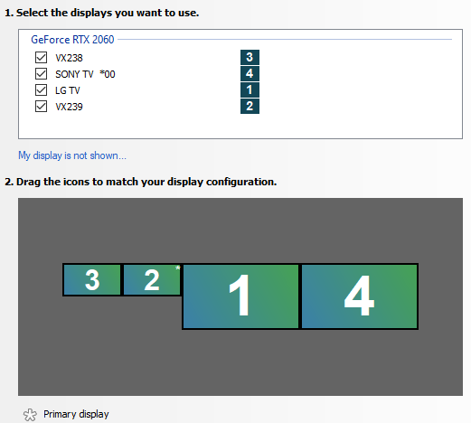
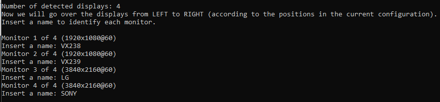
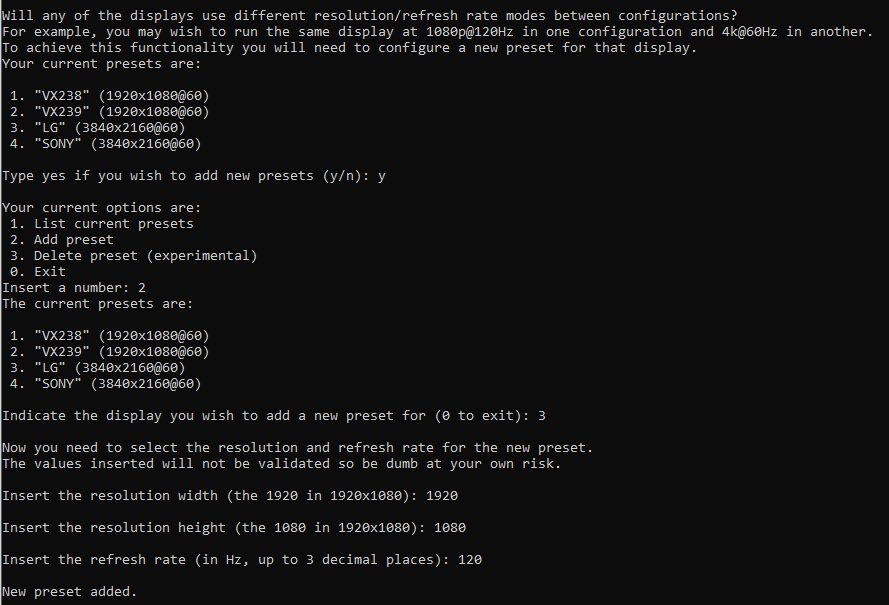
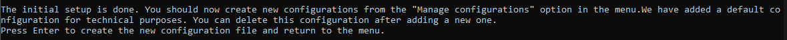
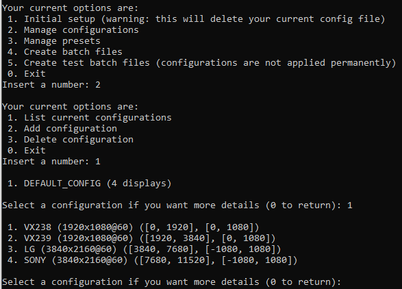
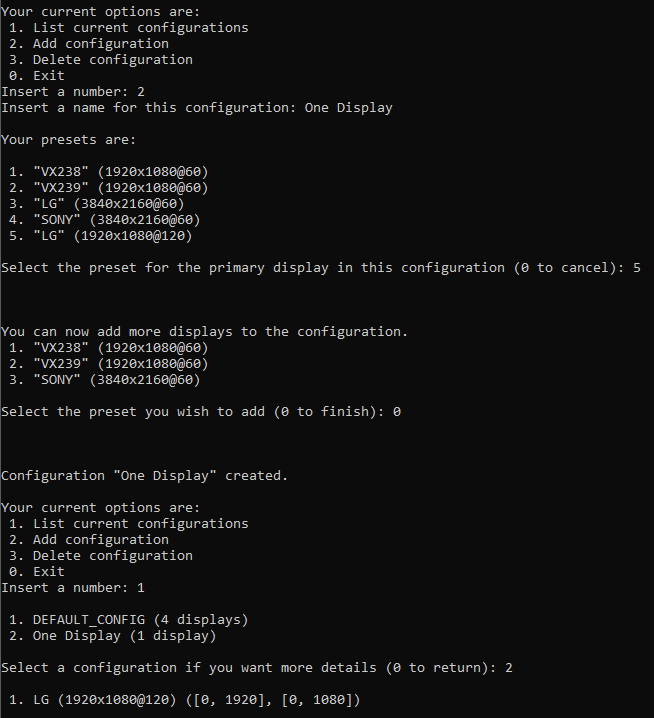
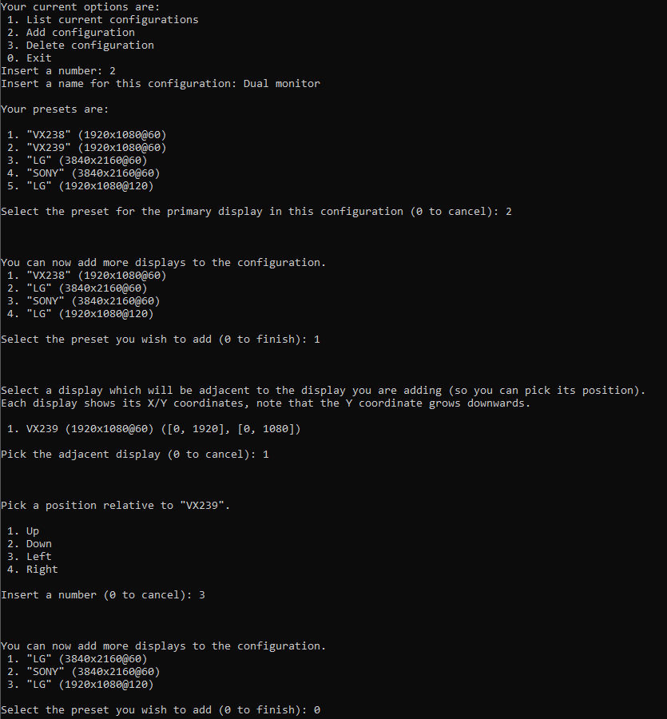
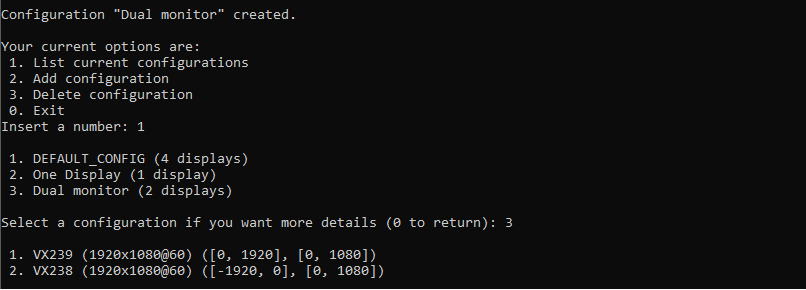

# EZVIDIA
## Display configuration manager for NVIDIA GPUs

EZVIDIA is a command-line tool for **Windows** and **NVIDIA** GPUs that allows a user to create and apply multiple display configurations. It is mainly targeted at users with multiple displays that frequently have to change their display configuration (through NVIDIA's Control Panel).

### Requirements
- Windows XP or later (64-bit only)
- NVIDIA GPU (with installed drivers)
- Latest 64-bit Visual C++ Redistributable ([link](https://support.microsoft.com/en-us/help/2977003/the-latest-supported-visual-c-downloads))

### Why
My personal motivation behind this project was the hassle of changing from my "desk" setup, which contains 2 23" displays, to my "living room" setup, which only contains my living room TV. When doing this through NVIDIA's Control Panel, I would have to go through the following steps:
1. Open NVIDIA's Control Panel
2. Select the 'multiple displays' tab
3. Toggle the checkboxes for the displays I'm turning on/off
4. Check if the displays are correctly arranged and which is the primary display (when dealing with multiple displays)
5. Press 'Apply'
6. After the new configuration is applied you have 20s to confirm it
7. (Optional) Change resolution/refresh rate of displays in the new configuration

Point 6 was especially annoying in my case, since I would have to rush to the other room before the timer ended.

Doing this everytime I wanted to use my PC on the living room got tiring, so I found out about NVAPI and decided to make this tool.

### How
This tool is written in C++ and makes use of NVIDIA's [NVAPI](https://developer.nvidia.com/nvapi). This SDK allows (between many other features) to control the display configuration, making this tool possible. All the source code I wrote is in this repo, you are free to fork and improve/expand upon it. None of the dependencies are included.

### How to use
After configuring all the desired configurations, the tool allows you to create a batch file for each configuration. Running this batch file simply calls the tool with the desired configuration as an argument, applying it instantly. You can create a shortcut to each batch file and place it in your start menu/desktop.

You can find the latest executable in the Releases part of this repository.

## Overview
The tool uses two main concepts: _preset_ and _configuration_. A _configuration_ is an arrangement of _presets_ at specific positions.

A _preset_ consists of a display ID (hidden to the user, identifies the display to the NVAPI), a name (given by the user), a resolution (height and width), a refresh rate, a rotation and a color depth (this one isn't editable). You may have multiple _presets_ with the same name and display ID but with different resolutions or refresh rates. This represents cases where a display can run at different resolutions/refresh rates.

_Configurations_ are sets of _presets_ but with additional position information for each _preset_. When a _configuration_ is created, it copies the information from each _preset_ used, which means any further change to one of the _presets_ won't be reflected on already existing _configurations_.

Both _presets_ and _configurations_ are stored in the _configs.json_ file. When the tool is executed with a configuration name as an argument (like by one of the generated batch files) it reads from the _configList_ array in the JSON, finds the corresponding configuration, and applies it.

## Tutorial
### 1. Place the executable inside an empty folder
Pretty straightforward. You can download the .exe from this repo's Releases or compile it yourself if you prefer. **Do not change the executable's name.**

### 2. Name your displays
Run the executable and you should arrive at the main menu. Select the first option to perform the **initial setup**. During this setup you will be asked to change your current display configuration so it includes all your displays on a horizontal grid. The following picture shows an example of how you should set your configuration.

The goal of this step is for you to name your displays, since I could not find a way to retrieve manufacturer/model information. You will be asked to name each display from **left to right**.

### 3. (Optional) Create more presets
After naming the displays you are asked if you want to create more presets. The tool will save the resolution, refresh rate and rotation you are currently using for each display, but sometimes you may wish for a display to be at a different resolution, refresh rate or rotation depending on the configuration. If you wish to do so, here you can create more presets for each display. Each preset stores a resolution and refresh rate combination for that display. In the following picture I add a 1080p@120Hz preset to my LG display (this picture is **outdated** and does not show the rotation options).

After you are done adding presets, exit the preset menu (by selecting option 0).

### 4. Creating your configurations
You should have reached the end of the initial setup:

After pressing Enter you will return to the main menu and a *configs.json* file will be created in the current directory. This file must always be in the same folder as the executable.

Now, from the main manu, select the second option (Manage configurations) to access the configuration management submenu. The first option in this submenu allows you to list all configurations (you will only have one initially) and check the display presets/positions in it:

The previous configuration is just a default one created with all your displays, but now you can create your own configurations.

When creating a configuration, the first step is to select your primary display (the one that Windows recognizes as primary). After selecting this display, you can finish the configuration or add more displays.

#### 4.1 One display
One display configurations are very straightforward:

#### 4.2 Two or more displays
If you want to add another display, you will need to pick its position relative to one of the displays already in the configuration. In the following example I start by selecting VX239 as my main display and then I decide to add the VX238 to the left of this display. The first thing the tool asks is the adjacent monitor (in this case there is only one choice) and then it asks for the position relative to it (in this case, to the left).

#### 4.3 Alignment
Since not all monitors are born equal, some displays in your configuration may have different resolutions. When two side-by-side monitors have different vertical resolutions, the tool will ask you how to align them (by the bottom edges, upper edges or centrally). The equivalent is also true when the horizontal resolutions don't match and you are trying to stack them vertically.

### 4.4 Rotation
The rotation of a display is part of its preset, so if you want to change the rotation of any display that should be done through a new preset in the "Manage presets" submenu. After creating a preset with rotation, it should display a bit differently from the other ones:

   2. "VX239" (1920x1080@60)
   3. "VX329" (1920x1080@60) (90 deg)

In the above example, I have two presets for the same display, one with a 90º rotation. I decided to print the "native" resolution of the display, 1920x1080, but in practice the rotated display takes up a 1080x1920 space. This difference is taken into account when the preset is added to a configuration. In the following configuration you can see this behaviour in effect:

   1. VX238 (1920x1080@60) (\[0, 1920], \[0, 1080])
   2. VX239 (1920x1080@60) (\[420, 1500], \[-1920, 0])
   
In this configuration, the VX239 (with a 90 deg rotation) is placed centrally above the VX238 (1080p unrotated) and, from the VX239 coordinates it is possible to see that it takes 1500-420 = 1080px horizontally and 1920px vertically.
### 5. Creating the batch files
When you are done creating the configurations (you can delete the DEFAULT_CONFIG now) and leave the configurations submenu, all your changes will be automatically saved to the *configs.json* file. Now you can select one of the *Generate batch files* options from the main menu.
- **Create batch files**: Creates one batch file per configuration, running this file instantly applies the configuration. The batch files **must** stay in the same folder as the executable. You can create shortcuts to place them somewhere else, or create your own batch files that contain the full path to the executable.
- **Create test batch files**: Also creates one batch file per configuration, but when running these files the configuration will not persist through restarts or after exiting some fullscreen applications. Good for testing configurations.

## Notes/Disclaimers
- This tool has only been tested by myself so I have no clue how it behaves with other GPU features like G-Sync.
- From my experience, settings like the color options in the NVIDIA Control Panel persist through configuration changes, which is nice.
- As stated in the tutorial, both the *configs.json* file and the batch files generated by the program must be in the same folder as the executable.
- There will obviously be bugs. If do you find them, please report them to me.
- This was my first experience with C++ so you will probably find some stupid things in the code. During the project I also experimented a bit with some features just to learn about them so some parts may be overengineered or not make much sense. If you see anything worth noting please do, so I can learn from it.
- I assume no responsability for any damage or inconvenience this tool causes.
