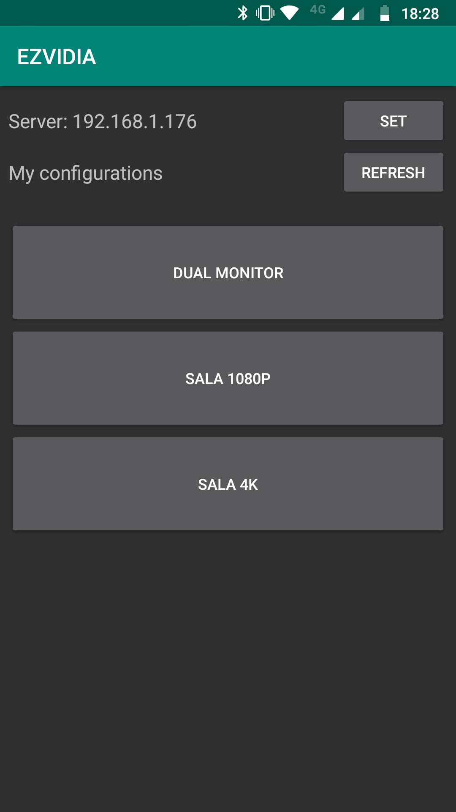

### Major Update
EZVIDIA went from a command-line tool to having a GUI! It lost the capability to manually create configurations, but now you can just save your current configuration, which is probably easier for most people. It also listen for UDP messages now, which allowed the development of an [Android app](https://github.com/fchamicapereira/EZVIDIA_android_app).

The files for the old version of EZVIDIA can be found in the folder _old__ezvidia_. All the new source files are in the _EZVIDIA_ folder.

# EZVIDIA
## Display configuration manager for NVIDIA GPUs

EZVIDIA is a tool for **Windows** and **NVIDIA** GPUs that allows a user to save and apply multiple display configurations. It offers two different methods to change configurations:
- Selecting the desired configuration from a popup menu:

	
- Sending a UDP message following a specific syntax. Works even if the computer is locked. This is implemented in an Android app (developed by [fchamicapereira](https://github.com/fchamicapereira)) available at [this repository](https://github.com/fchamicapereira/EZVIDIA_android_app). Here is a preview:

	

### Requirements
- 64-bit Windows (Only tested in Windows 10)
- NVIDIA GPU (with installed drivers)
- Latest 64-bit Visual C++ Redistributable ([link](https://support.microsoft.com/en-us/help/2977003/the-latest-supported-visual-c-downloads))

### How to use
Run the executable and look for a green notification icon in your task bar. To use the Android app, you will need to give it network permissions. Right-clicking this icon gives the option to save the current display configuration and to pick any of the saved configurations.

**Note:** After applying a configuration, there is a 5 seconds window where the tool ignores requests to change configuration again.

With the tool running, you can use the [Android app](https://github.com/fchamicapereira/EZVIDIA_android_app), to change the display configuration even if you are away from the computer or the computer is locked.

You can find the latest executable in the Releases page of this repository.

If you used the old version, you can reuse the _configs.json_ file by placing it in the same folder as the executable.

### Why
My personal motivation behind this project was the hassle of changing from my "desk" setup, which contains 2 23" displays, to my "living room" setup, which only contains my living room TV. When doing this through NVIDIA's Control Panel, I would have to go through the following steps:
1. Open NVIDIA's Control Panel
2. Select the 'multiple displays' tab
3. Toggle the checkboxes for the displays I'm turning on/off
4. Check if the displays are correctly arranged and which is the primary display (when dealing with multiple displays)
5. Press 'Apply'
6. After the new configuration is applied you have 20s to confirm it
7. (Optional) Change resolution/refresh rate of displays in the new configuration

Point 6 was especially annoying in my case, since I would have to rush to the other room before the timer ended.

Doing this everytime I wanted to use my PC on the living room got tiring, so I found out about NVAPI and decided to make this tool.

### How
This tool is written in C++ and makes use of NVIDIA's [NVAPI](https://developer.nvidia.com/nvapi). This SDK allows (between many other features) to control the display configuration, making this tool possible. All the source code I wrote is in this repo, you are free to fork and improve/expand upon it. None of the dependencies are included.

### UDP messages
The tool listen for two different types of UDP messages. A LIST message, which prompts a reply with all the current configurations:

	>>"LIST"
	<<"conf1;conf2;conf3;conf4"
	
And an APPLY message, which prompts the tool to apply the desired configuration:

	>>"APPLY conf1"
	<<"OK"
	>>"APPLY gibberish"
	<<"NOK"

## Notes/Disclaimers
- This tool has only been tested by myself so I have no clue how it behaves with other GPU features like G-Sync.
- From my experience, settings like the color options in the NVIDIA Control Panel persist through configuration changes, which is nice.
- There will obviously be bugs. If do you find them, please report them to me.
- This was my first experience with C++ so you will probably find some stupid things in the code. During the project I also experimented a bit with some features just to learn about them so some parts may be overengineered or not make much sense. If you see anything worth noting please do, so I can learn from it.
- I assume no responsability for any damage or inconvenience this tool causes.
