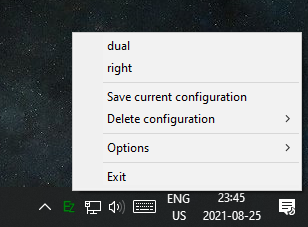
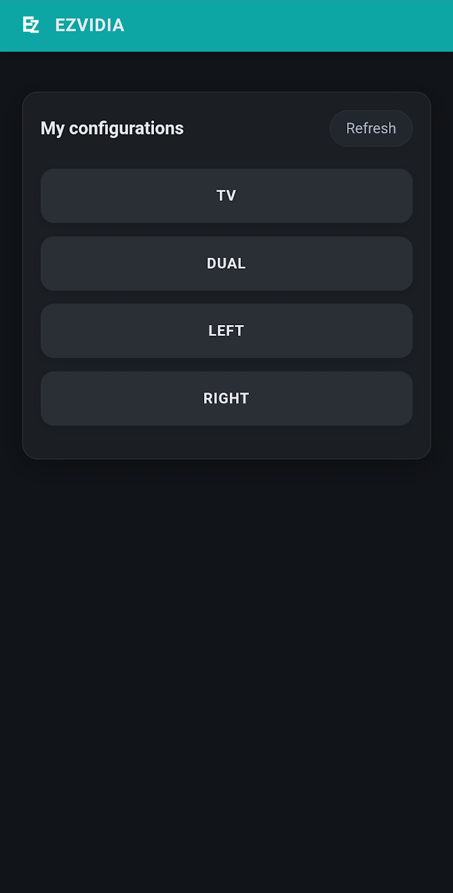

# EZVIDIA
## Display configuration manager for NVIDIA GPUs

EZVIDIA is a tool for **Windows** and **NVIDIA** GPUs that allows a user to save and apply multiple display configurations. Its features are:
- Quickly change configurations (two clicks).
- Can create 1 .bat file per configuration, you can add more commands to the file in order to combine this solution with other stuff in 1 action (e.g. audio switching or launching a program).
- A simple Web server that allows you to change configurations from any LAN device with a browser (e.g. phone, tablet, etc). It can be toggled on/off.
- Configurations are stored in a human readable format, so you can edit or even create one by hand for some odd reason.

## Requirements
- 64-bit Windows (Only tested in Windows 10)
- NVIDIA GPU (with installed drivers)
- Latest 64-bit Visual C++ Redistributable ([link](https://support.microsoft.com/en-us/help/2977003/the-latest-supported-visual-c-downloads))

## How to use

Just place the executable in a folder of your choice (it generates some auxiliary files) and run it, giving it network permissions if you're interested in the Web server feature.

### Desktop interface
Look for a green notification icon in your task bar. Right-clicking this icon gives the option to save the current display configuration and to pick any of the saved configurations.

### Web interface
**Make sure you enable this feature using the Desktop interface (`Options->Web Interface`) before trying to use it.** You should see a port number in the interface (default is a random port between `20000` and `30000` which is persisted in the JSON settings file). You can then access the Web interface by going to `http:\\<your local IP>:<port>`.

## How to build
Most recently built with MSVC 2022 (C++17). There's a vcpkg in the repo that should make dependencies easy. The only manual one is NVAPI, which is already included in the repo as a submodule. You'll only need to change the project configs to correctly include/link it. Or maybe those settings are also included in the project files in the repo? I don't know, just try it and ask an LLM if it doesn't work.

## Why
My personal motivation behind this project was the hassle of changing from my "desk" setup, which contains 2 23" displays, to my "living room" setup, which only contains my living room TV. When doing this through NVIDIA's Control Panel, I would have to go through the following steps:
1. Open NVIDIA's Control Panel
2. Select the 'multiple displays' tab
3. Toggle the checkboxes for the displays I'm turning on/off
4. Check if the displays are correctly arranged and which is the primary display (when dealing with multiple displays)
5. Press 'Apply'
6. After the new configuration is applied you have 20s to confirm it
7. (Optional) Change resolution/refresh rate of displays in the new configuration

Point 6 was especially annoying in my case, since I would have to rush to the other room before the timer ended.

Doing this everytime I wanted to use my PC on the living room got tiring, so I found out about NVAPI and decided to make this tool.